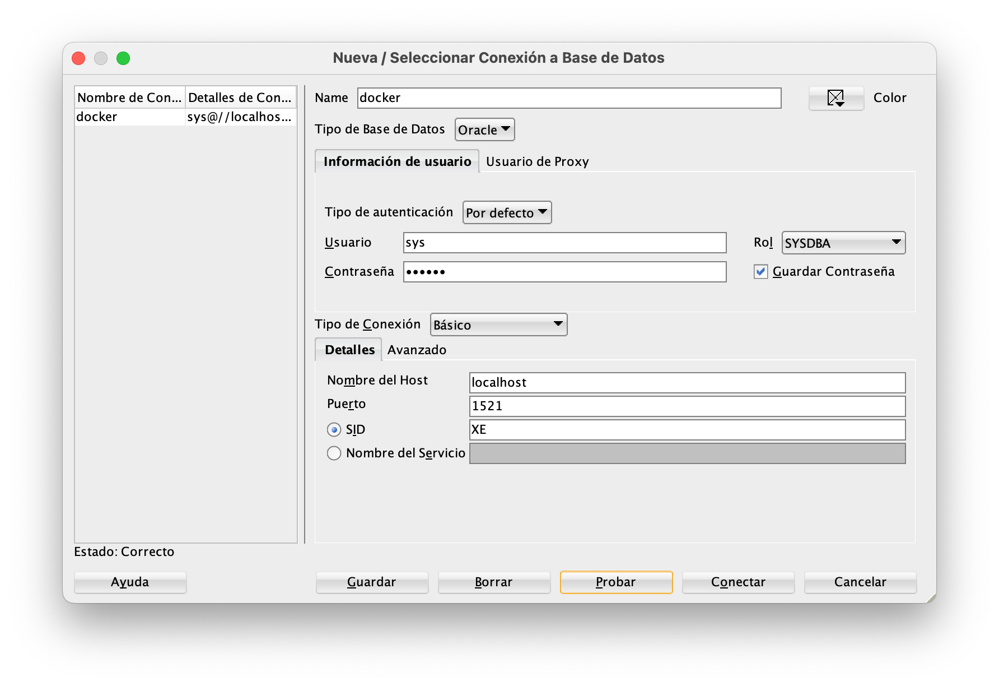

Instalar Oracle XE y ORDS en Linux Ubuntu & Docker
========================

# Introducción

Intentare ser breve y claro con las instrucciones para instalar Oracle XE y ORDS con Docker sobre la plataforma Linux Ubuntu. 

Ademas presumo que tienes conocimientos básicos de Docker y Docker-Compose

## Prerrequisitos

* La instalacion la realice en Linux Ubuntu 22.04, como siempre se debe actualizar ambiente:

```
 sudo apt update
 
 sudo apt upgrade

```
## Instrucciones
 
En el proyecto tengo 3 archivos docker-compose yml, realmente hay varios, pero vamos a revisar lo que estan en la carpeta DockerOracle, tal vez los otros te sirvan a futuro. 
 
 Descripción de los archivos  docker-compose:
 
 - [] **oracle-xe-ords.yml**: Permite instalar dos contedores simultamente, Oracle XE y Oracle ORDS.

 - []  **oracle-xe.yml**:  Instalar solo Oracle XE
 - [ ] **oracle-ords.yml**: Instalar solo Oracle ORDS

Para ejecutar cualquier archivo compose, solo debe seguir el formato, depende como estén configurados los privilegios, posiblemente debas anteponer el comando *sudo*.

docker-compose -f [archivo-compose.yml] up -d

ejemplo:


```
docker-compose -f oracle-xe.yml up -d

sudo docker-compose -f oracle-xe.yml up -d
```

##  ORACLE XE + Docker compose

El archivo *oracle-xe.yml* construye el contendor de la imagen definida y la monta en una red local, sino quieres tener *redlocal*, sencillamente remueve la instrucción de network, pero si vas usar una red local, ve al archivo *Redlocal.md* y ejecuta el comando.

También antes de ejecutar oracle-xe.yml, primero crear el volumen que vas usar
```
sudo docker volume create oracle-xe
```

```
version: '3.9'

networks:
    redlocal:
        external: true

volumes:
  oracle-xe:    
    external: true    
services:
  oracle-xe:
    restart: no
    container_name: oracle-xe
    image: container-registry.oracle.com/database/express:latest
    ports:
        - 1521:1521 # BD instancia
        - 5500:5500 # for Enterprise Manager
        - 8080:8080 # http-proxy
        - 22:22 # ssh 
    environment:
        ORACLE_SID: XE
        ORACLE_PDB: XEPDB1
        ORACLE_ALLOW_REMOTE: true 
        ORACLE_ENABLE_XDB: true
        ENABLE_TCPS: true
        ORACLE_CHARACTERSET: AL32UTF8
    volumes:
        - oracle-xe:/opt/oracle/oradata
    hostname: oracle-xe-dev

    networks:
          redlocal:
            ipv4_address: 10.72.0.11

```
Notaras que he abierto varios puertos, pero lo importante es tener el 1521 y 5500.  Puedes omitir los otros puertos


### Validar instalación Oracle-xe

Despues de ejecutar la creacion del contenedor puedes hacer esto:

> -- Ver si se levanto el contenor: 

`sudo docker ps-a `

> -- revisar el log del contenedor 

`sudo docker logs oracle-xe`

También hacer ping y ver si responde la BD

`ping <ip que definiste>`

Una vez instalado **oracle xe**, debemos preparar algunos detalles en la BD

### Configurar usuarios oracle xe
- [] Ejecutar este comando para resetear password de *Sys* y *System*, desde el equipo físico
```
sudo docker exec oracle-xe resetPassword MasterHunter
```
-[] O si lo prefieres también puedes hacer lo de manera
* ingrese al contenedor
```
 sudo docker exec -i -t oracle-xe /bin/bash 
```

 * Ingresar a Sqlplus dentro del docker, como 
```
bash-4.2$> sqlplus / as sysdba

```
* Ejecutar esto para cambiar el password de usuarios sys y system

```
 Sql> Alter user system identified by MasterHunter; 
 Sql> Alter user sys identified by MasterHunter; 
```
* Crear el tablespace para APEX

```
Alter session set container=XEPDB1;


CREATE TABLESPACE APEX 
    DATAFILE 
        '/opt/oracle/oradata/XE/XEPDB1/APEX_DATA01.DBF' SIZE 1073741824 REUSE AUTOEXTEND ON 
    
    ONLINE 
    SEGMENT SPACE MANAGEMENT AUTO;
```

* Crear el usuario **LAGASYSTEM** , puedes omitir este paso y en vez usar el sys o system.  Pero si ves el lagasystem o el usuario como lo quieras definir tiene su propio tablespace APEX.

```

-- USER SQL
CREATE USER "LAGASYSTEM"
IDENTIFIED BY MasterHunter
DEFAULT TABLESPACE "APEX"
TEMPORARY TABLESPACE "TEMP"
ACCOUNT UNLOCK ;

-- ROLES
grant dba, connect, resource to lagasystem;
grant unlimited tablespace to lagasystem;
grant create synonym, create public synonym to lagasystem;
grant create view to lagasystem;
```
* También modificamos el usuario **pdbadmin** cambiando el password y tablespace

```
alter user pdbadmin default tablespace apex;
alter user pdbadmin identified by Welcome$2023;
```

## Oracle ORDS + Docker Compose

### CONN_STRING conexion entre ORDS y XE

Para que ORDS se conecte a la base de datos XE, debe conocer el nombre de host donde se ejecuta la base de datos XE, la contraseña que se utilizará al conectarse y el nombre del servicio. Entonces, crearemos un archivo en nuestra máquina host y guardaremos la variable de cadena de conexión en él. Cuando activamos un contenedor **oracle-ords**, montaremos este archivo en el contenedor y ORDS usará la variable de cadena de conexión para conectarse a la base de datos. En esta demostración, crearemos una carpeta  la llamaremos **ords_secrets**, crearemos un archivo en la carpeta ORDS y lo llamaremos conn_string, en el archivo almacenaremos la variable de cadena de conexión.

Pasos: 
1. Crear sub carpetas **ords_secrets** y **ords_config**, donde se ubica el compose oracle-ords.yml
2. Dentro de la subcarpeta **ords_secrets** ejecutar el comando, su usuario, password, servidor e instancia correctos

`echo 'CONN_STRING=sys/<1230123>@<serverdatabase>:1521/XEPDB1'>conn_string.txt`


`CONN_STRING="lagasystem/MasterHunter@10.72.0.11:1521/XEPDB1"`

 **Datos de conexión**

| Clave            | Valor                               |
|------------------|-------------------------------------|
| Usuario          | `lagasystem`                        |
| Contraseña       | La configurada en el fichero `.env` |
| Tipo de conexión | Básico                              |
| Rol              | `SYSDBA`                            |
| Host             | `localhost`                         |
| Puerto           | `1521`                              |
| SID              | `XE`                                |

3. En el contenedor en volumen, mapear la unidad física con el contenedor oracle-ords.

```
volumes:
      - <indicarpathcompleto>/ords_secrets/:/opt/oracle/variables
      - <indicarpathcompleto>/ords_config/:/etc/ords/config/
```
#### Código completo de oracle-ords.yml

```
volumes:
  oracle-ords:    
    external: true           

networks:
    redlocal:
        external: true      

version: '3'
services:
  ords:
    container_name: oracle-ords
    restart: no
    image: container-registry.oracle.com/database/ords:latest
         
    volumes:
      - /home/lgutie/Dev/Containers/DockerOracle/ords_secrets/:/opt/oracle/variables
      - /home/lgutie/Dev/Containers/DockerOracle/ords_config/:/etc/ords/config/
    ports:
        - 8181:8181
        - 8880:8080
        - 8443:8443
    hostname: oracle-ords-dev
    networks:
        redlocal:
          ipv4_address: 10.72.0.13
```

### Probando Oracle XE y Oracle ORDS
Observe que son las ip que configure en mi red local, estas pueden cambiar según la decisión que tomo, asi que estas son la urls:

* https://10.72.0.11:5500/em/login

* http://10.72.0.13:8121/ords/apex 

Al ingresar a ORDS, prueba con estos datos:

Workspace: Internal
Username: Admin
Password: Welcome_1

ORACLE ORDS solicita que cambies la contraseña. y una vez actualizado,  ya tenemos listo el ambiente

## Instalar SqlDeveloper & Jdeveloper 




Bajar Jdeveloper de este link:
https://www.oracle.com/tools/downloads/jdeveloper-12c-downloads.html#

En la linea de comando darle permisos, ubicar el archivo donde lo descargo

`sudo chmod +x jdev_suite_122130_linux64.bin`


Posiblemente haga falta detalles en el readme.md, espero seguir mejorando esta redacción a futuro.

- [] Referencia documentación 
 https://blog.devgenius.io/running-oracle-database-in-docker-containers-661b6f6e1d71
 https://tm-apex.hashnode.dev/running-apex-in-docker-container


